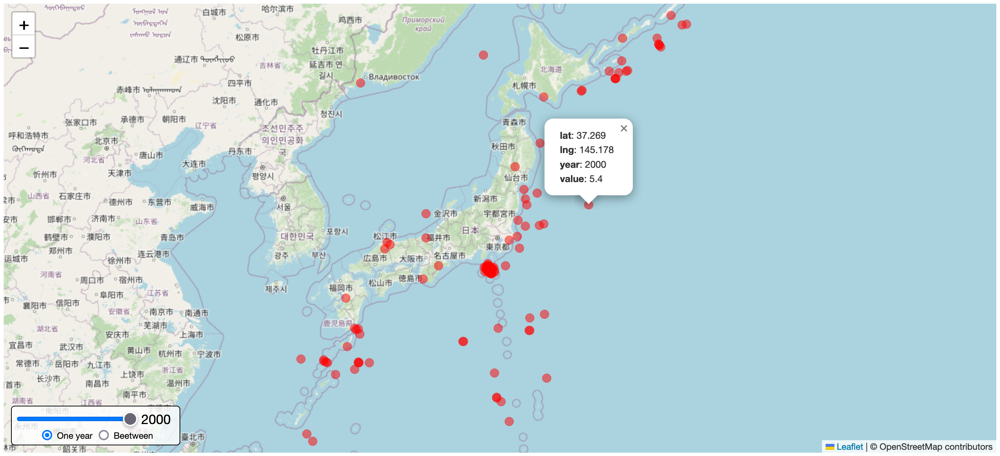
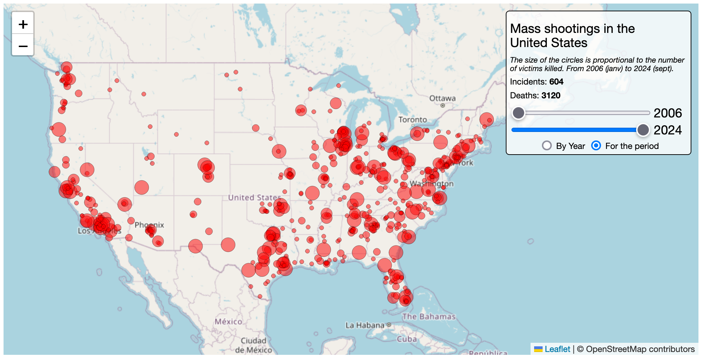

# Leaflet.TimeCtrl


**Leaflet.TimeCtrl** is a Leaflet plugin to display spatio-temporal data...

Made with ❤️ by [Richard Carlier](https://www.linkedin.com/in/rcarlier/) at _La Garenne Colombes_ (France).

## Documentation

You need to include the leaflet CSS/JS and `Leaflet.TimeCtrl` CSS/JS (and div with height for the map...)

```html
<link rel="stylesheet" href="lib/leaflet.min.css" />
<link rel="stylesheet" href="lib/leaflet.timeCtrl.min.css" />

<script src="lib/leaflet.min.js"></script>
<script src="lib/leaflet.timeCtrl.min.js"></script>
```

<mark>@soon</mark> : CDN ...

Add code after creating your map, usually after a data fetch...

```js
fetch("myFabulousData.json")
    .then((response) => response.json())
    .then((data) => {
        // If needed - see bellow...
        let options = {};
        // Call plugin, and add to map.
        L.timeCtrl(data, options).addTo(map);
    });
```

Data need to be structured as an array of object, with 3 dimensions : year, lat, lng (you can change name with options). A 4th dimension, `value` is used to create proportionnal circle.

```json
[
    {
        "year": 2010,
        "lat": 48.9068,
        "lng": 2.2464,
        "value": 123
    }
]
```

<mark>@todo </mark>

-   Make `value` optional if using fixed size circles...
-   Make "one year" and "interval" optional, and specify which one you want (exact, interval, or both...)
-   If you have both, choose the one you want by default
-   Choose default year (mini || maxi) ?

Options:

```js
let options = {
    text: {
        position: "bottomleft", // topright, topleft, bottomright, bottomleft
        title: null, // A good dataviz must have a title! HTML possible
        legend: null, // And sometimes a legend... - HTML possible
        exact: "One year", // label for "Only 1 year" radio btn
        inter: "Beetween", // label for "Interval of 2 years" radio btn
        rows: null, // null to NOT show numbers of row
        value: null, // null to NOT show sum of values (for current selection)
    },
    circle: {
        // If `mini` and `maxi` are different, the circles are drawn
        // proportionally to the value
        mini: 6, // minimum size of circle
        maxi: 6, // maximum size of circle
        color: "#FF0000", // circle outline color
        opacity: 0.5, // circle outline opacity
        weight: 0.5, // circle outline size
        fillColor: "#FF0000", // color inside the circle
        fillOpacity: 0.5, // opacity inside the circle
        popup: true, // show popup or not. If true, create a popup with all keys
    },
    data: {
        year: "year", // name of year field
        lat: "lat", // name of lat field
        lng: "lng", // name of lng field
        value: "value", // name of value field
    },
};
```

You can change **CSS** classes by overriding them.

See `src/leaflet.timeCtrl.css`

## Examples

### Significant Earthquakes in Japan



#### Data source

-   https://www.kaggle.com/datasets/jahaidulislam/significant-earthquake-dataset-1900-2023
    (only Japan)

#### Structure of JSON file

```json
[
    {
        "year": 1905,
        "lat": 25.967,
        "lng": 143.332,
        "value": 6.78
    }
]
```

#### Plugin call (no option, all default values are used)

```js
L.timeCtrl(data).addTo(map);
```

### Mass shootings in the United States

`examples/mass_killing.html`

Note: this plugin was finalized on September 5, 2024, the day after the Winder tragedy. This example was retained in memory of the victims (these, and all the others...).



#### Data source

-   https://data.world/associatedpress/mass-killings-public
    (I renamed/removed some columns of information)

On the same (sad) subject, you can also consult:

-   https://cssh.northeastern.edu/sccj/mass-killing-database/
-   https://www.theviolenceproject.org/mass-shooter-database/

#### Structure of JSON file

```json
[
    {
        "year": 2024,
        "longitude": -83.7856,
        "latitude": 33.94773,
        "killed": 4,
        "injured": 9,
        "date": "2024-09-04",
        "city": "Winder",
        "state": "GA",
        "location": "School",
        "narrative": "2 students and 2 teachers were killed and 9 others were injured ... "
    }
]
```

#### Plugin call (all options are used)

```js
let options = {
    text: {
        position: "topright", // topright, topleft, bottomright, bottomleft
        title: "Mass shootings in the<br>United States", // HTML possible
        legend: "The size of the circles is proportional...", // HTML possible
        exact: "By Year", // label for "Only 1 year" radio btn
        inter: "For the period", // label for "Interval of 2 years" radio btn
        rows: "Incidents", // null to NOT show
        value: "Deaths", // null to NOT show
    },
    circle: {
        mini: 3, // minimum size of circle
        maxi: 10, // maximum... or same as mini for constant size
        color: "#000", // circle outline color
        opacity: 0.5, // circle outline opacity
        weight: 0.5, // circle outline size
        fillColor: "#FF0000", // color inside the circle
        fillOpacity: 0.5, // opacity inside the circle
        popup: false, // show popup or not. If true, create a popup with all keys
    },
    data: {
        year: "year", // name of year field
        lat: "latitude", // name of lat field
        lng: "longitude", // name of lng field
        value: "killed", // name of value field
    },
};
L.timeCtrl(data, options).addTo(map);
```
